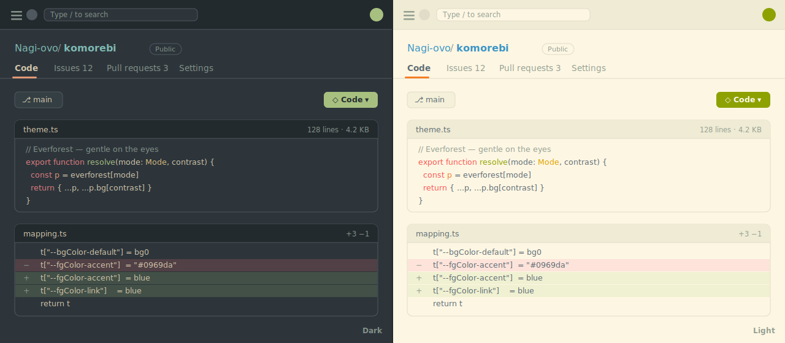

<p align="center">
  
</p>

<h1 align="center">Komorebi</h1>

<p align="center"><sub><b>木漏れ日</b> — dappled light through the leaves</sub></p>

<p align="center">
  <b>English</b> · <a href="README.zh-CN.md">简体中文</a> · <a href="README.ja.md">日本語</a>
</p>

<p align="center">
  
</p>

<p align="center">
  A calm theme for the web — GitHub, Google Search &amp; X — based on the
  <a href="https://github.com/sainnhe/everforest">Everforest</a> palette.<br/>
  Warm, low-contrast, easy on the eyes. Light &amp; dark, with a matching browser theme.
</p>

---

Pick your look from the toolbar popup — **Sync**, **Light**, or **Dark** — turn it on or off per
site (GitHub / Google / X), and it applies instantly.

<details>
<summary><b>Install</b></summary>

<br/>

Not on the Web Store yet. **Easiest:** grab `komorebi.zip` from [**Releases**](../../releases),
unzip it, then in `chrome://extensions` enable **Developer mode** → **Load unpacked** → pick the
unzipped folder.

Or build from source:

```bash
bun install && bun run build   # then load unpacked dist/
```

</details>

<details>
<summary><b>Theme the browser too</b> — tabs, toolbar, new tab</summary>

<br/>

`komorebi-browser-dark.zip` / `komorebi-browser-light.zip` in [Releases](../../releases) (or
`bun run build` → `chrome-themes/`). Load **one** unpacked.

A browser theme applies immediately and lives under **Settings → Appearance**
(`chrome://settings/appearance`), not the extensions list — only one can be active at a time.

</details>

<details>
<summary><b>Development</b></summary>

<br/>

```bash
bun run build       # dist/ + chrome-themes/
bun run watch       # rebuild on change
bun run typecheck
```

`palette.ts` → `mapping.ts` → `build.ts` generates `dist/theme.css` (GitHub); small per-site
stylesheets (`google.css`, `x.css`) cover the rest; the content script only toggles `data-ef-*` on
`<html>`. `demo/index.html` is a live light/dark preview on mock data.

</details>

## Acknowledgements

Komorebi is built on **[Everforest](https://github.com/sainnhe/everforest)** by
**[@sainnhe](https://github.com/sainnhe)** — its palette is the heart of this project. If you enjoy
it here, please ★ the original. 🌲

> Independent, open-source — not affiliated with or endorsed by GitHub, Google or X; their names
> are used only to describe what the theme covers. Everforest is MIT-licensed.

## License

MIT
